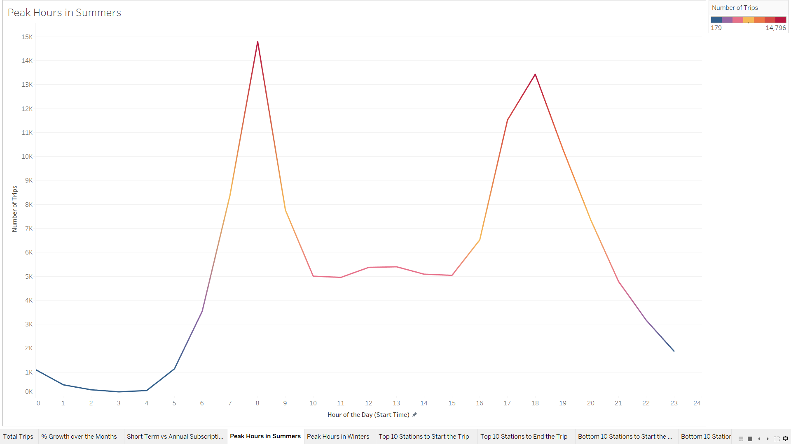
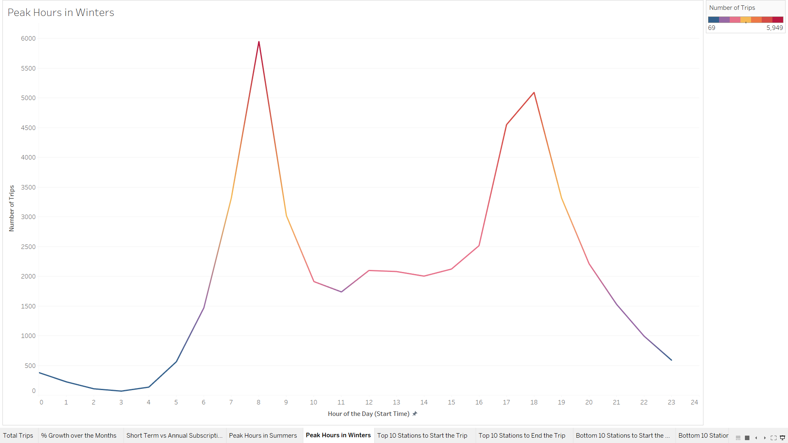
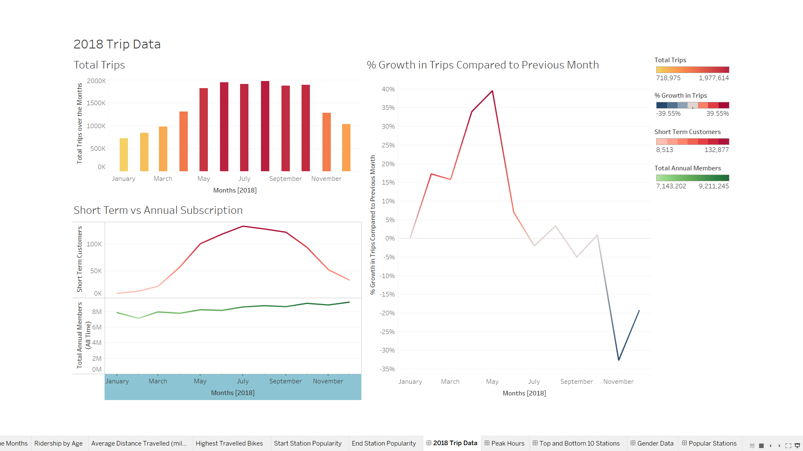
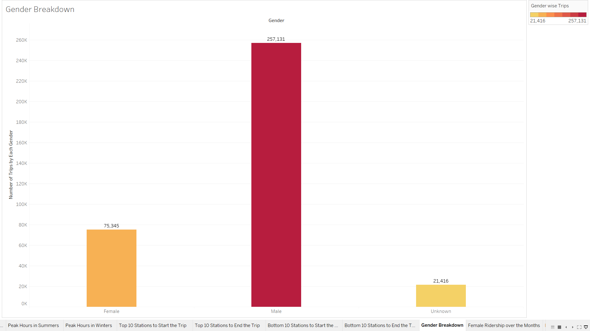
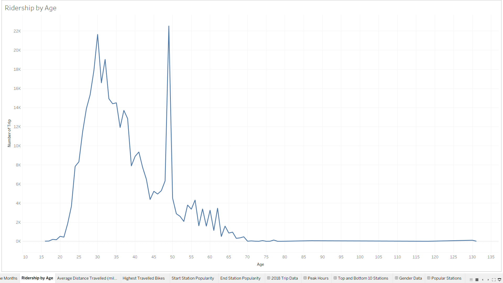
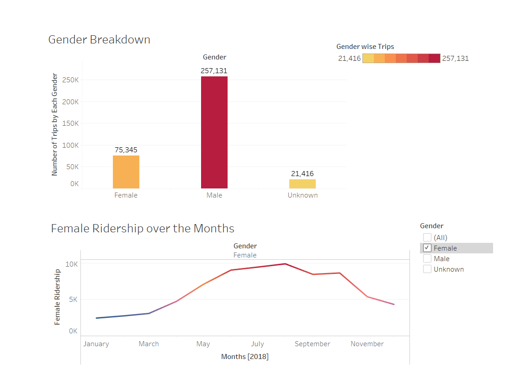

# Citi-Bike-Analytics

<<<<<<< HEAD
Click [here] (https://public.tableau.com/profile/garima3725#!/vizhome/City_Bike_Analytics_15706787116550/TotalTrips?publish=yes) to open the workbook.
=======
*Click [here] (https://public.tableau.com/profile/garima3725#!/vizhome/City_Bike_Analytics_15706787116550/TotalTrips?publish=yes) to open the workbook.
>>>>>>> 9685f50260ba084c54915b469ee2ef01b3e24a59

The objective of this exercise is to create a dashboard for the [New York Citi Bike](https://en.wikipedia.org/wiki/Citi_Bike) Program.

The data is collected, organized, and made public on the [Citi Bike Data](https://www.citibikenyc.com/system-data) webpage.

# Here are Some of the findings:

1: The peak hours during a day is usually 7-8 AM and 5-6 PM throughout the year.

2: As compared to the summer months the total ridership value goes down by a significant amount during the winter months.

 

3: The major bike riders fall into the age group of 25-30 and 45-50 years of males. However the ridership among female users seems to increase over time.

 
 
 
